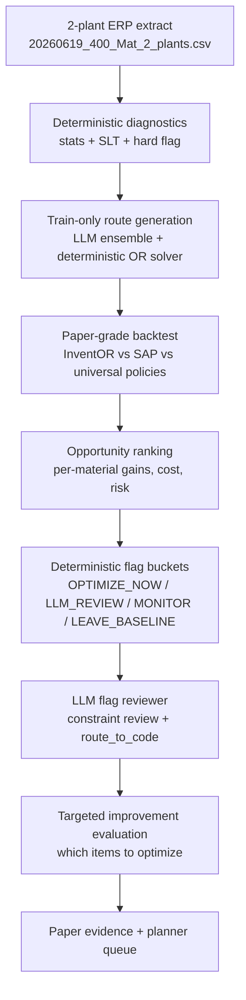

# InventOR Pipeline Overview

This document is the human-readable map of the current InventOR workflow.

The paper is not about a black-box LLM replacing inventory theory. It is about a governed OR pipeline where deterministic OR produces auditable policy candidates, and the LLM reviews where optimization should be applied, escalated, or left on baseline.

## One-Line Claim

InventOR identifies the minority of plant-material pairs where inventory optimization is worth doing, explains why, and routes each material to the next safe OR action.

## Pipeline Diagram



## Stage Table

| Stage | Input | Code Entry Point | Output | Human Meaning |
|---|---|---|---|---|
| 1. Raw data | `inventor_tests/20260619_400_Mat_2_plants.csv` | `deterministic_method/stats_calculator.py` | Demand, lead-time, cost, SAP baseline stats | Converts ERP rows into OR-ready diagnostics. |
| 2. SLT + governance | Stage 1 stats | `deterministic_method/slt_calculator.py`, `deterministic_method/hard_flag.py` | SLT recommendation, hard escalation reasons | Identifies unstable lead time, thin data, SAP SLT gaps, MILP-like edge cases. |
| 3. Route generation | Train-window diagnostics | `run_ensemble_test.py`, `ensemble_runner.py`, `model_solvers.py` | Paper-grade route/policy artifacts | LLM votes on route; deterministic OR computes numbers. |
| 4. Paper-grade backtest | Train-only routes + validation rows | `deterministic_method/backtest_simulator.py` | `results/aggregate_backtest.json` | Tests InventOR against SAP, universal `(r,Q)`, universal `(s,S)`, EOQ, and `k-sigma`. |
| 5. Opportunity ranking | Backtest per-item outcomes | `deterministic_method/export_optimization_targets.py` | `sample_artifacts/target_ranking.csv` | Finds where InventOR actually improves service or reduces stockout days. |
| 6. Deterministic flags | Target ranking CSV | `flagging_method/export_material_flags.py` | `sample_artifacts/material_flags.csv/jsonl` | Turns metrics into `OPTIMIZE_NOW`, `LLM_REVIEW`, `MONITOR`, or `LEAVE_BASELINE`. |
| 7. Ensemble LLM review | Material flag JSONL | `flagging_method/review_material_flags.py` | `sample_artifacts/reviewed_flags.csv/jsonl` | Five LLM runs vote on operational risks and next action (`route_to_code`). |
| 8. Baseline comparison | Targets + flags | `flagging_method/baseline_flagging_models.py` | `results/baseline_metrics.csv/json` | Compares flagging rules against simple threshold and decision-stump baselines. |
| 9. Targeted evaluation | Backtest + flags + reviewed flags | `flagging_method/evaluate_targeted_improvement.py` | `results/targeted_evaluation.csv`, `sample_artifacts/targeted_evaluation.json` | Tests whether selective optimization beats blanket optimization or SAP-only. |

## What Each Layer Is Allowed To Do

| Layer | Allowed | Not Allowed |
|---|---|---|
| Deterministic OR | Compute statistics, safety stock, reorder points, EOQ, `(r,Q)`, `(s,S)`, costs, and backtest outcomes. | Invent hidden constraints or override formulas without evidence. |
| LLM | Interpret diagnostics, flag hidden operational risks, choose review actions, write planner questions, select counterfactuals to rerun. | Recompute OR formulas or claim global optimality. |
| Reviewer output | Produce `final_bucket`, `route_to_code`, `code_task`, counterfactual priority, planner/supplier contacts. | Automatically change ERP settings without human approval. |

## Current Evidence Snapshot

| Evidence | Value |
|---|---:|
| Raw plant-material pairs | 301 |
| Paper-grade evaluated cohort | 98 |
| Train cutoff | 2026-03-10 |
| Validation end | 2026-06-19 |
| Materials with >1 pp fill-rate gain vs SAP | 16 |
| Materials with >=2 fewer stockout days vs SAP | 11 |
| Reviewed `OPTIMIZE_NOW` | 33 |
| Reviewed `LLM_REVIEW` | 17 |
| Reviewed `MONITOR` | 13 |
| Reviewed `LEAVE_BASELINE` | 35 |

## Baselines And Comparisons

| Comparison | Purpose | Artifact |
|---|---|---|
| InventOR vs SAP static | Operational incumbent comparison | `results/aggregate_backtest.json` |
| InventOR vs universal `(r,Q)` | OR counterfactual: does route selection add value beyond a simple policy? | `results/aggregate_backtest.json` |
| Deterministic flags vs simple rules | Checks whether triage is more than one threshold | `results/baseline_metrics.json` |
| Deterministic flags vs decision stump | Lightweight traditional ML-style comparator | `results/baseline_metrics.json` |
| LLM-reviewed flags vs deterministic flags | Tests whether LLM review is conservative and operationally useful | `sample_artifacts/reviewed_flags.csv` |
| Targeted strategies | Tests selective and cost-aware flagged optimization vs blanket optimization | `sample_artifacts/targeted_evaluation.json` |

## How We Verify LLM Flagging

LLM flagging is not evaluated by asking whether the LLM sounds plausible. It is evaluated by checking whether its reviewed buckets improve material selection compared with SAP-only, blanket InventOR, deterministic rules, and a simple traditional-ML-style decision stump.

| Strategy | Selected Items | Mean Fill Rate | Mean Cost | Stockout-Day Reduction vs SAP | Interpretation |
|---|---:|---:|---:|---:|---|
| SAP only | 0 / 98 | 92.8885 | 5,323.1479 | 0 | Incumbent baseline. |
| InventOR for all | 98 / 98 | 96.7958 | 9,759.1853 | 126 | Blanket optimization matches universal `(r,Q)` service but carries a strong cost premium. |
| Deterministic `OPTIMIZE_NOW` | 35 / 98 | 96.3300 | 8,923.0000 | 130 | Strong deterministic targeting. |
| Deterministic `OPTIMIZE_NOW` + `LLM_REVIEW` | 50 / 98 | 96.7800 | 8,867.0000 | 124 | Broader queue dilutes the cost discipline. |
| Decision stump on opportunity score | 15 / 98 | 96.6000 | 7,701.0000 | 123 | Lightweight traditional-ML-style baseline. |
| Ensemble LLM `OPTIMIZE_NOW` only | 33 / 98 | 96.2200 | 7,505.0000 | 117 | LLM review is selective but still more expensive than SAP. |
| Ensemble LLM `OPTIMIZE_NOW` + `LLM_REVIEW` | 50 / 98 | 96.7800 | 8,867.0000 | 124 | Reviewed queue preserves breadth while separating direct implementation from governed review. |
| Governed cost-aware service floor | 19 / 98 | 96.0674 | 5,329.6521 | 99 | Uses `OPTIMIZE_NOW` + `LLM_REVIEW`, enforces a per-item SAP service floor, and keeps mean cost near parity. |

Current verdict: the LLM is not a replacement optimizer. It is a governance filter over a deterministic OR intervention queue. The governed cost-aware service-floor rule then decides whether reviewed rows should stay on SAP, use InventOR, or use universal `(r,Q)`.

## LLM Review Outcome

| Reviewed Bucket | Count |
|---|---:|
| `OPTIMIZE_NOW` | 33 |
| `LLM_REVIEW` | 17 |
| `MONITOR` | 13 |
| `LEAVE_BASELINE` | 35 |

| `route_to_code` Action | Count |
|---|---:|
| `optimize_policy` | 15 |
| `request_planner_review` | 20 |
| `request_supplier_review` | 15 |
| `keep_baseline` | 48 |

Ensemble metadata is complete: all 98 rows have `status=ok`, all use `ensemble_n_runs=5`, 97 rows have five valid runs, one row has four valid runs, and confidence is HIGH for 95 rows and MEDIUM for 3 rows.

## Output Artifacts

| Artifact | Meaning |
|---|---|
| `results/aggregate_backtest.json` | Full paper-grade aggregate backtest. |
| `sample_artifacts/optimized_material_value_vs_sap.csv` | Selected materials, proposed policy values, SAP baseline values, and reviewed action. |
| `sample_artifacts/target_ranking.csv` | Per-material opportunity ranking. |
| `sample_artifacts/material_flags.csv` | Deterministic flag buckets. |
| `sample_artifacts/material_flags.jsonl` | Queue input for LLM review. |
| `sample_artifacts/reviewed_flags.csv` | LLM-reviewed flags and route-to-code actions. |
| `sample_artifacts/reviewed_flags.jsonl` | Full reviewed records with hidden constraints. |
| `results/baseline_metrics.json` | Rule and decision-stump baseline metrics. |
| `sample_artifacts/targeted_evaluation.json` | Selective optimization strategy comparison. |

## Plain-English Interpretation

The system does not claim that every material should switch from SAP to InventOR.

It claims something narrower and stronger: most materials do not justify complex optimization, but a subset does. InventOR finds that subset, explains the reason, compares it with SAP and universal `(r,Q)`, and asks LLM review to decide whether the next action should be direct optimization, counterfactual rerun, planner review, supplier review, monitoring, or baseline retention.

## Actual OR Use

The LLM review is not currently statistical evidence that an LLM is a better selector than deterministic rules or a simple decision stump. Current evidence shows the opposite: the decision stump and deterministic rules are stronger quantitative selectors on this dataset.

The OR use is therefore not "LLM optimization." It is a targeted intervention problem:

| OR Decision | Meaning |
|---|---|
| Select material `i` for optimization | Apply OR policy only where expected service gain or stockout reduction justifies effort. |
| Select material `i` for counterfactual rerun | Spend compute/planner time where model choice is uncertain or cost-risk tradeoff is unclear. |
| Select material `i` for planner/supplier review | Ask for missing operational constraints where ERP data is insufficient. |
| Leave material `i` on SAP | Avoid unnecessary optimization when gains are small or not robust. |

This can be written as a practical OR triage model:

$$
\max \sum_i x_i \cdot \widehat{B}_i - \lambda \sum_i x_i \cdot \widehat{C}_i - \mu \sum_i r_i
$$

subject to review capacity, implementation budget, risk thresholds, and data-quality constraints.

Where:
- $\widehat{B}_i$ is estimated benefit, e.g. fill-rate gain or stockout-day reduction vs SAP.
- $\widehat{C}_i$ is cost premium vs SAP or universal `(r,Q)`.
- $r_i$ is implementation or evidence risk, e.g. unstable lead time, low supplier reliability, thin delivery data.
- $x_i$ is the intervention decision: optimize, review, monitor, or leave baseline.

In this setup, deterministic OR supplies the numerical benefit and cost estimates. LLM review supplies operational-risk interpretation, hidden-constraint hypotheses, planner questions, and the next action. The final optimization problem remains an OR resource-allocation and value-of-information problem.

## What Not To Claim

| Do Not Claim | Why |
|---|---|
| "LLM flagging is statistically superior." | Current data has no human ground-truth labels and the decision stump is a stronger quantitative selector. |
| "LLM replaces inventory optimization." | All numerical policy values come from deterministic OR code. |
| "InventOR should replace SAP for all materials." | Blanket InventOR raises mean cost to universal `(r,Q)` levels for only a small average fill-rate gain over SAP. |

## What To Claim

| Defensible Claim | Evidence |
|---|---|
| OR targeting is more useful than blanket optimization. | Targeted strategies capture much more stockout reduction per selected material than blanket InventOR. |
| Deterministic diagnostics can isolate critical materials. | 16 materials improve fill rate by >1 pp vs SAP; 11 reduce stockout days by >=2. |
| LLM review is useful as governance, not as optimizer. | LLM review downgraded risky deterministic `OPTIMIZE_NOW` cases to review/counterfactual when cost, reliability, or lead-time risk was high. |
| The novel object is an intervention queue. | Output is not only policy parameters; it is `optimize_policy`, `rerun_counterfactual`, `request_planner_review`, or `keep_baseline`. |

## Paper Claim Mapping

| Paper Claim | Pipeline Evidence |
|---|---|
| Governed OR+LLM workflow | deterministic stages 1-6 plus LLM review stage 7 |
| LLM does not replace OR | all numeric policy values come from deterministic OR code |
| Targeted optimization beats blanket framing | material flags and targeted evaluation |
| Route selection is audited | universal `(r,Q)` counterfactual and branch diagnostics |
| Operational risk is explicit | hard flags, LLM hidden constraints, planner/supplier contact flags |

## Commands

```bash
python3 inventor_tests/inventor_cli.py summary
python3 inventor_tests/inventor_cli.py paper-backtest
python3 inventor_tests/inventor_cli.py paper-backtest --mode simulate --output /tmp/inventor_backtest.json
python3 inventor_tests/inventor_cli.py rank-targets
python3 inventor_tests/inventor_cli.py material-flags
python3 inventor_tests/inventor_cli.py baseline-flags
python3 inventor_tests/inventor_cli.py review-flags --limit 5
python3 inventor_tests/inventor_cli.py evaluate-targeting
```
